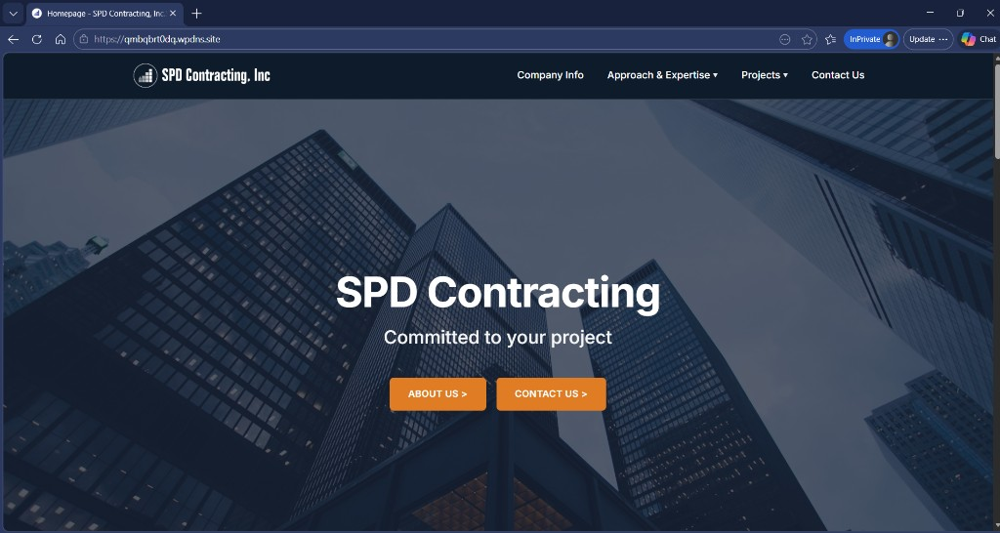
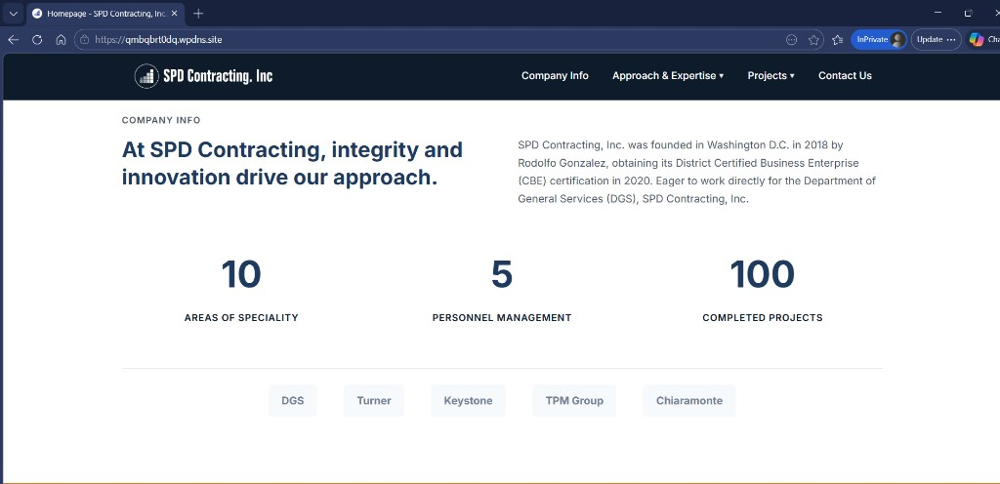
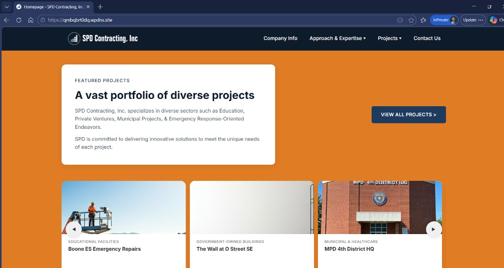
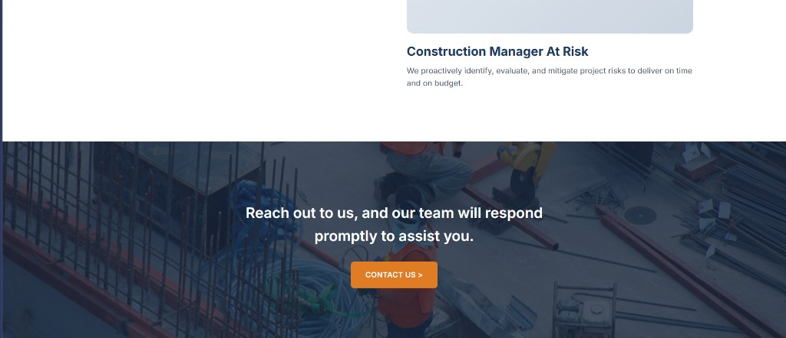

# SPD TEST

Este es el clon local del sitio de SPD en HTML/CSS/JS puro, pensado para que puedas probar cambios rápido y con tranquilidad antes de llevarlos a producción.

## Contexto (Portafolio)

Este proyecto existe como versión frontend liviana del sitio original en WordPress (`SPD landing page`), que era más incómodo de correr y mantener para iteraciones rápidas.

Para portafolio, esta versión es la principal porque:

- muestra implementación frontend clara (HTML/CSS/JS vanilla),
- facilita pruebas y ajustes sin dependencia de entorno WordPress,
- mantiene fidelidad visual y funcional respecto al sitio real.

Referencia del sitio en producción:

- https://qmbqbrt0dq.wpdns.site/

## Qué hice en este proyecto

- Migré y alineé la experiencia frontend desde WordPress a una versión estática mantenible.
- Estandaricé navegación, estructura de páginas, contenido y estilos para reflejar producción.
- Implementé componentes reutilizables (navbar, footer, carruseles y páginas data-driven).
- Organicé el proyecto para iterar rápido sin dependencias pesadas de WordPress local.

## Capturas del sitio

<p>
  
  
</p>
<p>
  
  
</p>

## Producción

- https://qmbqbrt0dq.wpdns.site/

## Correr en local

Usa un servidor local (no abrir con `file://`):

```bash
npx serve src/pages -p 3000
```

Luego abre:

- `http://localhost:3000/index.html`
- `http://localhost:3000/projects.html`

## Estructura rápida

- `src/pages/` páginas HTML
- `src/partials/` `header.html` y `footer.html`
- `src/assets/css/` estilos
- `src/assets/js/` lógica (navbar, carousel, data y renderizado)
